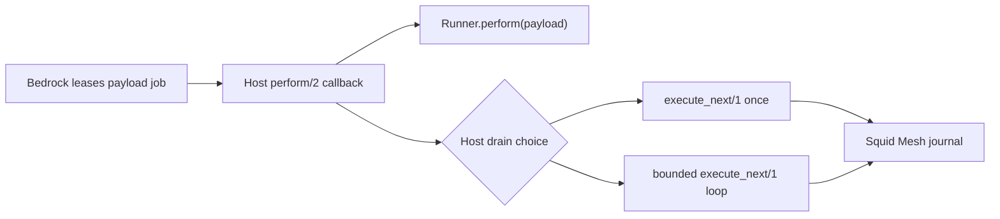
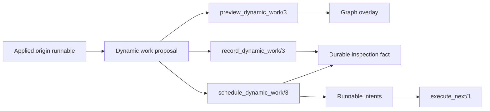

# SquidMesh

[](https://github.com/dark-trench/squid_mesh/actions/workflows/ci.yml)
[](https://codecov.io/gh/dark-trench/squid_mesh)
[](https://hex.pm/packages/squid_mesh)
[](https://hexdocs.pm/squid_mesh)
[](https://github.com/dark-trench/squid_mesh/blob/main/LICENSE)

---

Squid Mesh is an embedded durable workflow runtime for Elixir applications.

Define workflow modules, persist runs in your application database, and execute
visible work from host-owned workers with `SquidMesh.execute_next/1`.

```elixir
{:ok, run} =
  SquidMesh.start(MyApp.Workflows.Checkout, :manual, %{order_id: "order_123"})

{:ok, _snapshot} = SquidMesh.execute_next(owner_id: "checkout-worker-1")
```

Squid Mesh stores workflow state, step attempts, retries, approvals,
transitions, audit events, and recovery history in the host application's
database. It does not run as a separate service, broker, or orchestration
cluster.

The host application keeps its supervision tree, deployment model, repository,
schedulers, queue backend, and operator surfaces. Squid Mesh owns workflow
progression, transition routing, retry semantics, pause and approval handling,
replay and recovery policy, durable execution history, and graph inspection.

Queue delivery, worker supervision, and backend leasing remain host-owned
concerns. Storage portability is defined by the journal storage adapter
contract; the production relational implementation uses a Postgres-compatible
Ecto adapter. See the
[documentation guide](https://hexdocs.pm/squid_mesh/documentation.html) for
storage, integration, and operations topics.

> **Adoption status**
> Squid Mesh provides a supported `0.1.x` journal runtime for embedded host-app
> workflows.
>
> Treat production rollout as an application-owned integration: run the host-app
> smoke and resilience checks, review the operational boundaries, and adopt the
> queue/leasing strategy that matches your deployment. See
> [Production Readiness](docs/production_readiness.md) for the current baseline.

## Start Here

The fastest way to start is the guided Livebook. It demonstrates creating a
workflow, starting a durable run, executing work, and inspecting the result.

[](https://livebook.dev/run?url=https%3A%2F%2Fgithub.com%2Fdark-trench%2Fsquid_mesh%2Fblob%2Fmain%2Fdocs%2Fgetting_started.livemd)

| Goal | Resource |
| --- | --- |
| Find the right guide | [Documentation guide](https://hexdocs.pm/squid_mesh/documentation.html) |
| Run a guided interactive example | [Getting Started Livebook](docs/getting_started.livemd) |
| Integrate Squid Mesh into an existing application | [Getting Started guide](docs/getting_started.md) |
| Review a complete working example | [Minimal host app](examples/minimal_host_app/README.md) |
| Add backend-owned delivery and leases | [Bedrock minimal host app](examples/bedrock_minimal_host_app/README.md) |

The written guide covers installation, workflow creation, execution, run
inspection, retries, manual gates, cron triggers, and Bedrock-backed leases.

## Getting Started

Documentation and examples:

| Reference | Description |
| --- | --- |
| [Getting Started](docs/getting_started.md) | Setup and first workflow run |
| [Workflow Authoring](docs/workflow_authoring.md) | Triggers, steps, transitions, retries, and compensation |
| [Host App Integration](docs/host_app_integration.md) | Phoenix and OTP integration |
| [Reference Workflows](docs/reference_workflows.md) | Approval, recovery, saga, and cron examples |
| [Minimal Host App](examples/minimal_host_app/README.md) | Executable example application |
| [Bedrock Minimal Host App](examples/bedrock_minimal_host_app/README.md) | Backend-owned delivery with leases and retry requeue |
| [Architecture](docs/architecture.md) | Runtime flow and component boundaries |

## Installation

Add Squid Mesh to your dependencies:

```elixir
defp deps do
  [
    {:squid_mesh, "~> 0.1.0"}
  ]
end
```

Configure the repo and default queue:

```elixir
config :squid_mesh,
  repo: MiddleEarth.Repo,
  queue: "default"
```

Install and run the migration:

```sh
mix deps.get
mix squid_mesh.install
mix ecto.migrate
```

To keep workflow modules formatted consistently as DSL-style declarations,
import Squid Mesh formatter rules in `.formatter.exs`:

```elixir
[
  import_deps: [:squid_mesh],
  inputs: ["{mix,.formatter}.exs", "{config,lib,test}/**/*.{ex,exs}"]
]
```

Finally, start one host-owned executor loop. The loop is not a separate Squid
Mesh service; it is just a supervised process in your application that asks
Squid Mesh for the next visible workflow attempt.

This example uses a `GenServer` because it is a small OTP shape for scheduling
the next drain. A queue worker, cron process, or existing host scheduler can
own the same `SquidMesh.execute_next/1` call. Hosts can use Bedrock, Oban, a
custom queue, or any other executor they already operate:

```elixir
defmodule MyApp.SquidMeshWorker do
  use GenServer

  def start_link(opts \\ []) do
    GenServer.start_link(__MODULE__, opts, name: __MODULE__)
  end

  def init(opts) do
    owner_id = Keyword.get(opts, :owner_id, "my-app-squid-mesh")
    {:ok, %{owner_id: owner_id}, {:continue, :drain}}
  end

  def handle_continue(:drain, state), do: {:noreply, drain_once(state)}
  def handle_info(:drain, state), do: {:noreply, drain_once(state)}

  defp drain_once(state) do
    interval =
      case SquidMesh.execute_next(owner_id: state.owner_id) do
        {:ok, :none} -> 100
        {:ok, _snapshot} -> 0
        {:error, _reason} -> 1_000
      end

    Process.send_after(self(), :drain, interval)
    state
  end
end
```

Add capacity limits, metrics, shutdown policy, and placement rules around the
same `SquidMesh.execute_next/1` boundary. See
[Host App Integration](docs/host_app_integration.md) for the full host shape.

### Optional: Bedrock Job Runner And Leases

Use Bedrock when the host application needs backend-owned delivery, delayed
visibility, job leases, heartbeat/lease extension, retry requeue, and recovery.
Keep workflow modules backend-neutral; Bedrock belongs behind host adapter
modules.

If the supervised worker loop above can call `SquidMesh.execute_next/1` often
enough for your workload, start there. Add Bedrock only when the host needs a
durable job backend for payload delivery, delayed visibility, worker leases,
and redelivery after worker or node failure.

#### 1. Configure Squid Mesh

Point Squid Mesh at the host repo. Use the same queue your host payload worker
passes to `SquidMesh.execute_next/1`:

```elixir
config :squid_mesh,
  repo: MyApp.Repo,
  queue: "tenant_a"
```

#### 2. Configure Payload Delivery

Keep the delivery adapter in the host app. It maps Squid Mesh cron activations
or drain requests into Bedrock jobs:

```elixir
config :my_app, MyApp.SquidMeshDeliveryAdapter,
  queue_id: "tenant_a",
  topic: "squid_mesh:payload"
```

#### 3. Start The Host Runtime

Start the repo, Bedrock cluster, and Bedrock queue under the host supervision
tree:

```elixir
children = [
  MyApp.Repo,
  {MyApp.BedrockCluster, []},
  {MyApp.JobQueue, concurrency: 5, batch_size: 10}
]

Supervisor.start_link(children, strategy: :one_for_one, name: MyApp.Supervisor)
```

#### 4. Add A Delivery Adapter

The adapter owns Bedrock job enqueueing. Workflow modules should not know
Bedrock exists:

```elixir
defmodule MyApp.SquidMeshDeliveryAdapter do
  alias SquidMesh.Executor.Payload

  def enqueue_cron(_config, workflow, trigger, opts) do
    payload =
      Payload.cron(
        workflow,
        trigger,
        Keyword.take(opts, [:signal_id, :intended_window])
      )

    MyApp.JobQueue.insert(%{
      topic: "squid_mesh:payload",
      queue_id: "tenant_a",
      payload: payload,
      scheduled_in: opts[:schedule_in]
    })
  end
end
```

#### 5. Add A Host Payload Worker

Bedrock leases a payload job and invokes the host callback. From there, the
code is host-owned: `perform/2` delivers the Squid Mesh payload, then this
example runs a bounded drain loop while the Bedrock job lease is held.

The loop comes from the host callback, not from Bedrock. A host can call
`SquidMesh.execute_next/1` once per job instead; bounded draining is just a
capacity choice for this example:



```elixir
defmodule MyApp.Jobs.SquidMeshPayload do
  use Bedrock.JobQueue.Job,
    topic: "squid_mesh:payload",
    max_retries: 3,
    priority: 100

  alias SquidMesh.Runtime.Runner

  def perform(payload, _meta) when is_map(payload) do
    case Runner.perform(payload) do
      :ok -> drain_journal_attempts("tenant_a", 0)
      {:ok, _snapshot} -> drain_journal_attempts("tenant_a", 0)
      {:error, reason} -> {:error, reason}
    end
  end

  defp drain_journal_attempts(_queue, 50) do
    {:error, :journal_drain_limit_exceeded}
  end

  defp drain_journal_attempts(queue, count) do
    case SquidMesh.execute_next(
           queue: queue,
           owner_id: "my-app-bedrock-worker",
           heartbeat_interval_ms: 10_000
         ) do
      {:ok, :none} -> :ok
      {:ok, _snapshot} -> drain_journal_attempts(queue, count + 1)
      {:error, reason} -> {:error, reason}
    end
  end
end
```

#### 6. Configure Both Lease Layers

The Bedrock lease protects job delivery. The Squid Mesh heartbeat protects the
workflow attempt claimed by `execute_next/1`:

```elixir
config :my_app, MyApp.Jobs.SquidMeshPayload,
  journal_heartbeat_interval_ms: 10_000,
  max_journal_attempts: 50
```

Do not enqueue one Bedrock job per workflow step, and do not model workflow
step retries as Bedrock job retries. A normal step failure, retry, or terminal
run is durable Squid Mesh state returned by `SquidMesh.execute_next/1`.

Treat `{:ok, snapshot}` from `execute_next/1` as successful host-worker
progress even when the snapshot describes a failed workflow run. Return
`{:error, reason}` to Bedrock only when payload delivery or the host drain
itself failed and should be redelivered.

For the concrete setup, see
[Bedrock Lease Backend Setup](docs/host_app_integration.md#bedrock-lease-backend-setup)
and the
[Bedrock Minimal Host App](examples/bedrock_minimal_host_app/README.md).

## Workflows

Workflows are Elixir modules. A trigger declares the entrypoint and validates
the payload before the run is persisted.

Steps declare their inputs, outputs, retry policy, and compensation behavior.
Transitions wire them together.

This workflow demonstrates manual gates, approval flows, conditional routing,
retries, saga compensation, and irreversible steps:

```elixir
defmodule MiddleEarth.Workflows.RingErrand do
  use SquidMesh.Workflow

  workflow do
    trigger :leave_shire do
      manual()

      payload do
        field :bearer, :string, default: "Frodo"
        field :ring_id, :string
        field :route_preference, :string, default: "moria"
      end
    end

    step :pack_provisions, Hobbiton.Steps.PackProvisions,
      output: :provisions

    step :hide_at_prancing_pony, :pause

    approval_step :council_vote,
      output: :council,
      deadline: [within: 300_000, due_soon: 60_000, escalation: :operator_action]

    step :choose_path, Rivendell.Steps.ChoosePath,
      input: [bearer: [:bearer], decision: [:council, :decision]],
      output: :route

    step :cross_moria, Fellowship.Steps.CrossMoria,
      input: [:bearer, :provisions, :route],
      retry: [max_attempts: 3, backoff: [type: :exponential]],
      deadline: [within: 30_000, due_soon: 5_000, escalation: :diagnostic]

    step :reserve_eagle, Eagles.Steps.ReserveRide,
      compensate: Eagles.Steps.CancelRide

    step :toss_ring, Mordor.Steps.TossRing,
      irreversible: true

    transition :pack_provisions, on: :ok, to: :hide_at_prancing_pony
    transition :hide_at_prancing_pony, on: :ok, to: :council_vote
    transition :council_vote, on: :ok, to: :choose_path
    transition :choose_path, on: :ok, to: :cross_moria
    transition :cross_moria, on: :ok, to: :reserve_eagle
    transition :cross_moria, on: :error, to: :complete, recovery: :undo
    transition :reserve_eagle, on: :ok, to: :toss_ring
    transition :toss_ring, on: :ok, to: :complete
  end
end
```

Steps and approvals can declare diagnostic deadlines with `deadline: [...]`.
Squid Mesh persists the due timestamps in runnable and manual-control facts and
surfaces evaluated states such as `:on_time`, `:due_soon`, `:overdue`, and
`:escalated` through `list_runs/2`, `inspect_run/2`,
`inspect_run_graph/2`, and `explain_run/2`. Alert delivery, paging, and
operator escalation remain host-owned; the runtime only records durable
deadline evidence and safe next actions.

Cron-triggered workflows use scheduling declarations:

```elixir
defmodule Gondor.Workflows.BeaconWatch do
  use SquidMesh.Workflow

  workflow do
    trigger :nightly_beacon_check do
      cron "0 21 * * *", timezone: "Etc/UTC"

      payload do
        field :beacon_count, :integer, default: 7
      end
    end

    step :inspect_hilltops, Gondor.Steps.InspectHilltops,
      retry: [max_attempts: 3]

    step :light_beacon, Gondor.Steps.LightBeacon,
      compensate: Gondor.Steps.ExtinguishBeacon

    transition :inspect_hilltops, on: :ok, to: :light_beacon
    transition :light_beacon, on: :ok, to: :complete
  end
end
```

Dependency-based workflows use `after: [...]` for parallel execution:

```elixir
defmodule Gondor.Workflows.ParallelAttack do
  use SquidMesh.Workflow

  workflow do
    trigger :start do
      manual()
    end

    step :march_to_gate, Gondor.Steps.MarchToGate
    step :rally_rohan, Rohan.Steps.RallyArmy
    step :distract_sauron, Fellowship.Steps.DistractEnemy

    step :declare_victory, Gondor.Steps.DeclareVictory,
      after: [:march_to_gate, :rally_rohan, :distract_sauron]
  end
end
```

## Running Workflows

Start a workflow run:

```elixir
{:ok, run} =
  SquidMesh.start(
    MiddleEarth.Workflows.RingErrand,
    :leave_shire,
    %{ring_id: "one-ring"}
  )
```

Inspect a run with full history:

```elixir
SquidMesh.inspect_run(run.run_id, include_history: true)
```

Get an operator-facing explanation:

```elixir
{:ok, explanation} = SquidMesh.explain_run(run.run_id)
explanation.reason #=> :waiting_for_retry
explanation.evidence.command_counts #=> %{"start_run" => 1, "cancel_run" => 2}
```

The `explain_run/2` function summarizes the current state, valid next actions, and supporting evidence for dashboards and operational tooling.

## Approvals and Manual Gates

Pause steps and approval steps block progression until explicitly resolved:

```elixir
# Resume a paused step
SquidMesh.resume(run.run_id, %{actor: "strider", reason: "ready to proceed"})

# Approve or reject an approval gate
SquidMesh.approve(run.run_id, %{actor: "elrond", note: "approved"})
SquidMesh.reject(run.run_id, %{actor: "elrond", note: "rejected"})
```

For idempotent command delivery, use explicit runtime signals:

```elixir
alias SquidMesh.Runtime.Signal

{:ok, signal} =
  Signal.approve_run(run.run_id, %{actor: "elrond", note: "approved"},
    idempotency_key: "approval-#{run.run_id}"
  )

{:ok, approved_run} = SquidMesh.apply_signal(signal)
```

Reusing an idempotency key returns the existing result without creating duplicate command receipts. Approval steps persist their resolved targets and output metadata, surviving deploys and restarts.

## Compensation and Recovery

Workflow authors can mark completed side effects as compensatable so operators
and host tools can see the rollback contract when later work fails:

```elixir
step :borrow_rope, Lothlorien.Steps.BorrowRope,
  compensate: Lothlorien.Steps.ReturnRope

step :reserve_eagle, Eagles.Steps.ReserveRide,
  compensate: Eagles.Steps.CancelRide

step :cross_moria, Fellowship.Steps.CrossMoria,
  retry: [max_attempts: 3]
```

A failed `:cross_moria` exposes the completed compensatable steps and their
declared callbacks through `inspect_run/2`, `inspect_run_graph/2`, and
`explain_run/2`. The callback metadata is persisted with each runnable so
dashboards can show rollback availability even if the workflow module changes.

For side effects that cannot be reversed, mark steps as `irreversible: true` or `compensatable: false`. Squid Mesh exposes these boundaries during inspection and blocks replay by default after irreversible execution.

## Child Workflows

Steps can spawn child workflow runs for dynamic work expansion:

```elixir
defmodule Hobbiton.Steps.SendInvites do
  use SquidMesh.Step, name: :send_invites

  @impl true
  def run(%{party_id: party_id, guests: guests}, %SquidMesh.Step.Context{} = context) do
    children =
      for guest <- guests do
        {:ok, child} =
          SquidMesh.start_child_run(
            context,
            Hobbiton.Workflows.DeliverInvite,
            %{party_id: party_id, guest_id: guest.id},
            child_key: "invite_#{guest.id}"
          )

        child.run_id
      end

    {:ok, %{child_run_ids: children}}
  end
end
```

Each child run has independent inspection, retry, replay, and cancellation. Repeating the same `child_key` returns the existing child instead of creating duplicates.

## Inspectable Dynamic Work

Host code can preview, record, or schedule bounded dynamic work for an active
run. Preview is read-only, record persists inspection metadata, and schedule
persists the same dynamic-work fact while planning executable runnable intents:

```elixir
registry = %{"digest.deliver" => MyApp.Steps.DeliverDigest}

{:ok, preview} =
  SquidMesh.preview_dynamic_work(
    run.run_id,
    %{
      dynamic_key: "subscription_digest_fanout",
      origin: %{
        runnable_key: "run_123:schedule_digest:1",
        step: "schedule_digest",
        attempt: 1
      },
      reason: :runtime_fanout,
      nodes: [
        %{id: "deliver_digest:chat_1", action: "digest.deliver"}
      ]
    },
    action_registry: registry
  )

preview.origin_node_id
preview.added_node_ids
preview.added_edge_ids
preview.recordable?
preview.graph.nodes
```

After previewing, choose one durable write path. Use `record_dynamic_work/3`
when the dynamic structure should be inspectable only:

```elixir
{:ok, snapshot} =
  SquidMesh.record_dynamic_work(
    run.run_id,
    %{
      dynamic_key: "subscription_digest_fanout",
      origin: %{
        runnable_key: "run_123:schedule_digest:1",
        step: "schedule_digest",
        attempt: 1
      },
      reason: :runtime_fanout,
      nodes: [
        %{id: "deliver_digest:chat_1", action: "digest.deliver"}
      ]
    },
    action_registry: registry
  )
```

Use `schedule_dynamic_work/3` instead when the dynamic nodes should execute:

```elixir
{:ok, snapshot} =
  SquidMesh.schedule_dynamic_work(
    run.run_id,
    %{
      dynamic_key: "subscription_digest_fanout",
      origin: %{
        runnable_key: "run_123:schedule_digest:1",
        step: "schedule_digest",
        attempt: 1
      },
      reason: :runtime_fanout,
      nodes: [
        %{
          id: "deliver_digest:chat_1",
          action: "digest.deliver",
          input: %{subscription_id: "sub_123"}
        }
      ]
    },
    action_registry: registry
  )
```

Think of dynamic work as a late graph patch attached to an already-applied
runnable. The three public calls all validate the same proposal; they differ in
how much of that proposal becomes durable.

| Call | Journal write | Runnable work | Best fit |
| --- | --- | --- | --- |
| `preview_dynamic_work/3` | None | None | Show the proposed graph change before committing it |
| `record_dynamic_work/3` | Inspection fact | None | Make generated structure visible to operators and dashboards |
| `schedule_dynamic_work/3` | Inspection fact and runnable intents | Yes | Add executable dynamic nodes to the run |



Every proposal is checked against the current run snapshot:

| Rule | Why it matters |
| --- | --- |
| Stable `dynamic_key`, node ids, and optional edge ids | Prevents duplicate or drifting graph patches |
| Origin metadata with runnable key, step, and attempt | Ties the patch to the work that produced it |
| Applied origin runnable for scheduling | Prevents executable work from appearing before its producer finished |
| `:action_registry` for scheduling | Keeps executable action keys behind a host-owned allowlist |
| Terminal run rejection | Keeps completed runs closed to new work |

Preview returns normalized dynamic work plus a graph overlay. Visual editors get
stable metadata from that overlay: producer node id, added node ids, added edge
ids, whether recording would append a durable fact, and warnings such as
duplicate dynamic work.

Recording and scheduling are alternatives, not a promotion flow. Recording
stores only the inspection fact. Scheduling stores that fact and the runnable
intents in one run-thread write; the normal `execute_next/1` path then claims,
executes, retries, applies, and inspects the dynamic attempts.

Executable dynamic nodes must use approved action keys and may include an
`input` map for the attempt. They can opt into persisted retry with
`retry: [max_attempts: n]`. Dynamic edges are graph-inspection metadata for now;
scheduled dynamic nodes are queued as independent runnable intents.

Dynamic steps are replay-unsafe by default and require manual review before
irreversible replay. Scheduling an already-recorded node with the same id is
rejected by duplicate-node validation.

`inspect_run_graph/2` also exposes `dynamic_work_overlays` so dashboards and
visual editors can show producer nodes, added node ids, and added edge ids
without reconstructing them from raw dynamic-work records.

## Long-Running Steps

Workers can ask the journal executor to renew the active claim while a step is
running:

```elixir
SquidMesh.execute_next(
  owner_id: "billing-worker-1",
  lease_for: 30,
  heartbeat_interval_ms: 10_000
)
```

The executor keeps raw claim tokens internal. Durable heartbeat entries store
only the claim-token hash and are fenced by the same claim id and token used for
completion or failure. The minimum heartbeat interval is 50ms; production
workers should choose a much larger interval relative to `lease_for`.

## Runtime-Authored Specs

Host-owned editors or databases can activate validated workflow specs without
runtime code generation. Use stable action keys, resolve them through an
allowlist, then start the resolved spec through the public API:

```elixir
registry = %{"digest.record_delivery" => MyApp.Steps.RecordDigestDelivery}

:ok = SquidMesh.Workflow.validate_spec(spec, action_registry: registry)

{:ok, run} =
  SquidMesh.start_spec(spec, :manual_digest, payload,
    action_registry: registry
  )
```

Squid Mesh persists the resolved definition with the run so workers and
`inspect_run_graph/2` can inspect and execute it later. Replay for
runtime-authored spec runs is intentionally rejected until that lifecycle is
supported.

Visual-editor JSON can use the same host-owned action allowlist before a draft
graph with top-level action keys is accepted:

```elixir
:ok = SquidMesh.Workflow.EditorSpec.validate_map(editor_map, action_registry: registry)
{:ok, graph} = SquidMesh.Workflow.EditorSpec.preview_graph(editor_map, action_registry: registry)
{:ok, diff} = SquidMesh.Workflow.EditorSpec.diff(source_spec, editor_map, action_registry: registry)
```

These editor APIs still validate, preview, and compare data only. Starting a
runtime-authored run remains the separate `start_spec/3` or `start_spec/4`
boundary.

## Cancellation, Replay, and Listing

```elixir
{:ok, running_runs} = SquidMesh.list_runs(status: :running)
{:ok, _} = SquidMesh.cancel(run.run_id)
{:ok, _} = SquidMesh.replay(run.run_id)

# Replay past irreversible steps requires an explicit override
{:ok, _} = SquidMesh.replay(run.run_id, allow_irreversible: true)
```

## Graph Inspection

Inspect the workflow graph with execution state:

```elixir
{:ok, graph} = SquidMesh.inspect_run_graph(run.run_id)

graph
|> SquidMesh.Runs.GraphInspection.to_map()
|> Map.take([:status, :current_node_ids, :nodes, :edges])
```

The graph includes nodes, edges, and the selected transition path for conditional routing.
Nested workflow starts stay as separate runs; parent graph maps include
`child_links` so dashboards and visual editors can render subflow links without
treating child workflows as inline executable nodes.

### Node Visibility and Redaction

Graph nodes can include host-domain inputs, outputs, errors, manual metadata,
and dynamic-work metadata. By default, `inspect_run_graph/2` omits detailed
payload fields; request `include_history: true` only for trusted operator
surfaces.

Before exposing graph payloads outside a trusted boundary, apply a host-owned
visibility policy:

```elixir
{:ok, graph} = SquidMesh.inspect_run_graph(run.run_id, include_history: true)

{:ok, visible_graph} =
  SquidMesh.ReadModel.Visibility.redact(graph, current_actor, MyApp.VisibilityPolicy)
```

External/operator views preserve node ids, status, current state, recovery
availability, dynamic-work shape, and safe edge topology while removing node
payloads, errors, attempt details, command history, and sensitive metadata.

## Actor Visibility

Squid Mesh provides built-in support for actor-scoped visibility to safely expose workflow data to different users. The runtime tracks actor information in manual actions and provides flexible redaction policies:

```elixir
# Define a visibility policy
defmodule MyApp.VisibilityPolicy do
  @behaviour SquidMesh.ReadModel.Visibility.Policy

  def visibility_scope(actor, _view) do
    cond do
      actor.role == "admin" -> :auditor     # Full access
      actor.role == "support" -> :operator  # Operational details
      true -> :external                     # Minimal information
    end
  end
end

# Apply redaction at API boundaries
{:ok, snapshot} = SquidMesh.inspect(run_id)
safe_view = SquidMesh.ReadModel.Visibility.redact(snapshot, current_user, MyApp.VisibilityPolicy)
```

The three standard scopes provide appropriate data access:
- `:external` - High-level status only, all sensitive data redacted
- `:operator` - Includes operational metrics and debugging information
- `:auditor` - Complete unredacted access for privileged users

See the [Actor Visibility Guide](docs/actor_visibility.md) for comprehensive documentation on implementing multi-tenant access patterns, role-based visibility, and security best practices.

## Optional Dashboard

[SquidSonar](https://github.com/dark-trench/squid_sonar) is the optional read-only Phoenix LiveView dashboard for Squid Mesh. Mount it inside a Phoenix host application to inspect recent runs, filter by status, search runtime metadata, and view run detail pages with diagnosis, history counts, last error information, and workflow graph visualization.

## Contributing

Please review the existing runtime model and workflow semantics before proposing substantial changes. Contributions are most welcome in: runtime reliability, workflow ergonomics, inspection tooling, recovery semantics, documentation improvements, backend integrations, and executable examples.

- [Contributing Guide](CONTRIBUTING.md)
- [Code of Conduct](CODE_OF_CONDUCT.md)
- [Elixir Forum discussion thread](https://elixirforum.com/t/squid-mesh-workflow-automation-runtime-for-elixir-applications/75162)
- [GitHub Issues](https://github.com/dark-trench/squid_mesh/issues)
- [Squid Mesh channel on the Jido Discord](https://discord.com/channels/1323353012235796550/1504122798027571331)

## License

Copyright 2024, released under the [Apache 2.0 License](LICENSE).
