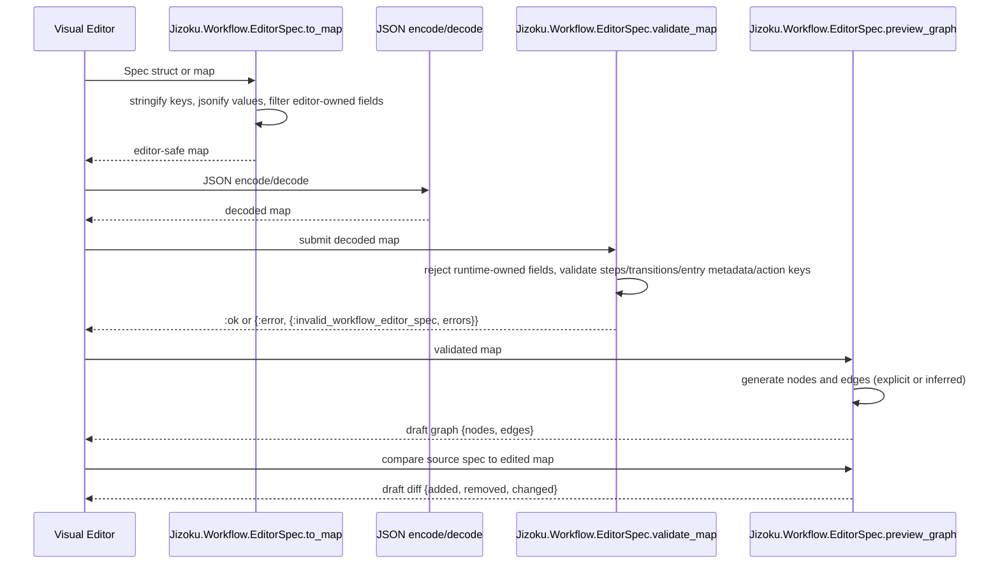

# Workflow Authoring

This guide documents the workflow contract and authoring patterns.

> ### Learn with Livebook
>
> The interactive Livebook demonstrates dependency workflows, DSL declaration, spec normalization, input mapping, execution, and graph output.
> [](https://livebook.dev/run?url=https%3A%2F%2Fgithub.com%2Fdark-trench%2Fjizoku%2Fblob%2Fmain%2Fdocs%2Fworkflow_authoring.livemd)

## Formatter Setup

Jizoku exports formatter rules for workflow DSL calls. Host apps can import
them from their `.formatter.exs`:

```elixir
[
  import_deps: [:jizoku],
  inputs: ["{mix,.formatter}.exs", "{config,lib,test}/**/*.{ex,exs}"]
]
```

## Define A Workflow

Workflows are Elixir modules that `use Jizoku.Workflow` and declare:

- one trigger
- one payload contract
- one or more steps
- transitions between steps
- optional dependency-based `after: [...]` joins on steps that wait for other work
- optional retry policy on the steps that own side effects
- optional recovery markers for irreversible or non-compensatable side effects

```elixir
defmodule Billing.Workflows.PaymentRecovery do
  use Jizoku.Workflow

  workflow do
    trigger :payment_recovery do
      manual()

      payload do
        field :account_id, :string
        field :invoice_id, :string
        field :attempt_id, :string
        field :gateway_url, :string
      end
    end

    step :load_invoice, Billing.Steps.LoadInvoice
    step :wait_for_settlement, :wait, duration: 5_000
    step :log_recovery_attempt, :log,
      message: "Invoice loaded, checking gateway status",
      level: :info
    step :check_gateway_status, Billing.Steps.CheckGatewayStatus,
      retry: [max_attempts: 5, backoff: [type: :exponential, min: 1_000, max: 30_000]]
    step :notify_customer, Billing.Steps.NotifyCustomer

    transition :load_invoice, on: :ok, to: :wait_for_settlement
    transition :wait_for_settlement, on: :ok, to: :log_recovery_attempt
    transition :log_recovery_attempt, on: :ok, to: :check_gateway_status
    transition :check_gateway_status, on: :ok, to: :notify_customer
    transition :notify_customer, on: :ok, to: :complete
  end
end
```

## Validate Workflow Specs

Compiled workflows can be exposed as normalized, serializable specs for tooling,
inspection, and planner rebuilds:

```elixir
{:ok, spec} = Jizoku.Workflow.to_spec(Billing.Workflows.PaymentRecovery)
:ok = Jizoku.Workflow.validate_spec(spec)
```

`validate_spec/1` validates the spec as data. It checks trigger shape, payload
fields, step modules, step options, transitions, dependency graphs, retry
policies, and entry metadata without starting a run and without coupling the
workflow to a specific delivery backend.

Runtime-authored specs can avoid raw module atoms by referencing host-owned
action keys and validating through an action registry:

```elixir
registry = %{
  "billing.load_invoice" => Billing.Steps.LoadInvoice,
  "billing.send_reminder" => [module: Billing.Steps.SendReminderEmail]
}

spec = %{
  workflow: Billing.Workflows.RuntimeInvoiceReminder,
  triggers: [
    %{
      name: :manual,
      type: :manual,
      config: %{},
      payload: [%{name: :invoice_id, type: :string, opts: []}]
    }
  ],
  payload: [%{name: :invoice_id, type: :string, opts: []}],
  steps: [
    %{name: :load_invoice, action: "billing.load_invoice", opts: []},
    %{name: :send_reminder, action: "billing.send_reminder", opts: []}
  ],
  transitions: [%{from: :load_invoice, on: :ok, to: :send_reminder}],
  retries: [],
  entry_steps: [:load_invoice],
  initial_step: :load_invoice,
  entry_step: :load_invoice
}

:ok = Jizoku.Workflow.validate_spec(spec, action_registry: registry)
{:ok, resolved_spec} = Jizoku.Workflow.resolve_spec_actions(spec, action_registry: registry)

{:ok, run} =
  Jizoku.start_spec(spec, :manual, %{invoice_id: "inv_123"},
    action_registry: registry
  )
```

The registry is an allowlist. Entries must resolve to loaded `Jizoku.Step`
modules or explicit `Jido.Action` modules. Unknown keys, disabled entries such
as `[module: Billing.Steps.LoadInvoice, enabled?: false]`, and incompatible
modules return structured `{:invalid_workflow_spec, errors}` before activation.
Resolved specs keep the stable action key on each step and in step metadata so
inspection and graph tooling can show the approved action identity.

`start_spec/3` starts a runtime-authored spec through its default trigger;
`start_spec/4` starts a named trigger. Both paths validate and resolve the spec
at the start boundary when `:action_registry` is supplied, persist the resolved
definition with the run, and execute from that persisted definition. This lets
`inspect_run/2` and `inspect_run_graph/2` keep working even when the workflow
module name is only a stable identity for a UI-authored workflow. Replaying
runtime-authored spec runs is intentionally rejected for now with
`{:error, {:invalid_replay_source, :runtime_spec}}`.

## Visual Editor Round Trips

Visual editors should round-trip workflow specs through
`Jizoku.Workflow.EditorSpec` when they need JSON-safe data. This boundary is
for loading, validation, preview, editing, and saving. It does not start a run,
load workflow modules from user input, create atoms from strings, or resolve
action keys into executable modules.

```elixir
{:ok, spec} = Jizoku.Workflow.to_spec(Billing.Workflows.PaymentRecovery)

editor_map =
  spec
  |> Jizoku.Workflow.EditorSpec.to_map()
  |> Jason.encode!()
  |> Jason.decode!()

:ok = Jizoku.Workflow.EditorSpec.validate_map(editor_map)
{:ok, graph} = Jizoku.Workflow.EditorSpec.preview_graph(editor_map)
```

When editor JSON uses runtime-authored top-level action keys, pass the same
host-owned registry used by the start boundary:

```elixir
registry = %{"billing.load_invoice" => Billing.Steps.LoadInvoice}

:ok =
  Jizoku.Workflow.EditorSpec.validate_map(editor_map,
    action_registry: registry
  )

{:ok, draft_graph} =
  Jizoku.Workflow.EditorSpec.preview_graph(editor_map,
    action_registry: registry
  )

{:ok, draft_diff} =
  Jizoku.Workflow.EditorSpec.diff(spec, editor_map,
    action_registry: registry
  )
```

The round-trip boundary is intentionally data-only:



Use `Jizoku.preview_spec/3` when an editor needs execution-style node output
for a sample payload before publishing or starting a run. Preview execution is
read-only: it resolves action keys through the host registry, calls only entries
that opt into `dry_run` behavior, returns per-node outputs or unsupported
markers, and does not append journal state.

```elixir
registry = %{
  "billing.load_invoice" => [module: Billing.Steps.LoadInvoice, dry_run: true],
  "billing.send_receipt" => [module: Billing.Steps.SendReceipt]
}

{:ok, preview} =
  Jizoku.preview_spec(editor_map, %{invoice_id: "inv_123"},
    action_registry: registry
  )

Enum.map(preview.nodes, &Map.take(&1, [:id, :status, :output, :error]))
```

Registry entries without `dry_run: true` or an explicit `dry_run: {Module,
:function}` callback are reported with `status: :unsupported`; Jizoku never
falls back to the durable action `run/2` callback during preview.

The editor map uses string keys and JSON-safe values. Editors own declarative
workflow fields: `workflow`, `definition_version`, `triggers`, `payload`,
`steps`, `transitions`, `retries`, `entry_steps`, `initial_step`, and
`entry_step`. Runtime-owned fields such as `run_id`, `status`,
`definition_fingerprint`, `spec_fingerprint`, `journal`, `attempts`,
`dispatches`, and `audit_history` are rejected by `validate_map/1` if a client
tries to submit them.

Preview graphs use the same step and edge ids a dashboard needs, but every node
is still draft data:

```elixir
%{
  "source" => "workflow_spec",
  "status" => "draft",
  "nodes" => [
    %{"id" => "load_invoice", "status" => "draft"},
    %{"id" => "send_reminder", "status" => "draft"}
  ],
  "edges" => [
    %{
      "id" => "load_invoice:ok:send_reminder",
      "from" => "load_invoice",
      "to" => "send_reminder",
      "type" => "transition",
      "status" => "pending",
      "selected?" => false,
      "skipped?" => false,
      "pending?" => true,
      "blocked?" => false,
      "outcome" => "ok",
      "condition" => nil,
      "recovery" => nil
    }
  ]
}
```

Validation errors keep stable paths for field highlighting:

```elixir
{:error, {:invalid_workflow_editor_spec, errors}} =
  Jizoku.Workflow.EditorSpec.validate_map(%{
    "workflow" => "Billing.Workflows.PaymentRecovery",
    "triggers" => [],
    "payload" => [],
    "steps" => [%{"name" => "load_invoice", "action" => "billing.load_invoice"}],
    "transitions" => [
      %{"from" => "load_invoice", "on" => "ok", "to" => "missing_step"}
    ],
    "retries" => [],
    "entry_steps" => ["load_invoice"],
    "initial_step" => "load_invoice",
    "entry_step" => "load_invoice"
  })

[%{path: [:transitions, 0, :to], code: :unknown_transition_target}] = errors
```

For runtime-authored workflow activation, keep using `validate_spec/2`,
`resolve_spec_actions/2`, and `start_spec/3` or `start_spec/4` with a host-owned
action registry. The editor preview contract is intentionally read-only; runtime
activation still happens at the Jizoku start boundary so action allowlists,
payload validation, durable definition persistence, and journal inspection stay
centralized.

Hosts that want a reusable HTTP node can expose `Jizoku.Step.HTTP` through the
same registry:

```elixir
registry = %{
  "http.request" => [
    module: Jizoku.Step.HTTP,
    category: "HTTP",
    action_opts: [allowed_hosts: ["api.example.test"]],
    credential_requirements: [%{name: "billing_api", required?: true}]
  ]
}

:ok =
  Jizoku.Step.HTTP.validate_request(%{
    method: "GET",
    url_template: "https://api.example.test/invoices/{{ invoice_id }}",
    bindings: %{"invoice_id" => "inv_123"},
    timeout: 1_000
  }, allowed_hosts: ["api.example.test"])
```

HTTP action inputs are normal step inputs. Host-owned `action_opts` are copied
into the resolved runtime spec and enforced both before run start and during
step execution. Keep credential values outside the request map; use
host-owned `credential_refs` and action-catalog metadata to describe which
references the host can supply. URLs must not include userinfo or query
strings; raw bodies and response-body persistence require explicit host
`action_opts`. Successful requests add a redacted `http_response` to run
context. Retryable HTTP or transport failures return structured retry errors so
workflow retry policy controls the next attempt.

Hosts that want runtime-authored workflows to call custom Elixir logic can
expose `Jizoku.Step.Elixir` and keep executable ownership in registry
`action_opts`:

```elixir
registry = %{
  "elixir.run" => [
    module: Jizoku.Step.Elixir,
    category: "Elixir",
    input_contract: %{
      adapter: %{type: :string, required?: true, enum: ["billing.load_invoice"]},
      params: %{type: :map, required?: true}
    },
    action_opts: [
      adapters: %{
        "billing.load_invoice" => {Billing.Actions, :load_invoice}
      }
    ]
  ]
}
```

Runtime-authored inputs provide an approved adapter key and a params map:

```elixir
%{
  adapter: "billing.load_invoice",
  params: %{invoice_id: "inv_123"}
}
```

Pass the registry at start and execution boundaries:

```elixir
{:ok, run} =
  Jizoku.start_spec(spec, :manual, payload,
    action_registry: registry
  )

{:ok, snapshot} =
  Jizoku.execute_next(
    owner_id: "worker",
    action_registry: registry
  )
```

Do not let editor data provide module names, function names, or code snippets.
`Jizoku.Step.Elixir` rejects those fields, validates adapter keys before run
start, persists only safe adapter metadata in runtime specs, and converts
adapter failures into structured action errors.

The spec is an Elixir data representation with atom keys and module atoms:

```elixir
%Jizoku.Workflow.Spec{
  workflow: Billing.Workflows.PaymentRecovery,
  definition_version: "2026-05-26.payment-recovery",
  triggers: [
    %{
      name: :payment_recovery,
      type: :manual,
      config: %{},
      payload: [
        %{name: :account_id, type: :string, opts: []},
        %{name: :invoice_id, type: :string, opts: []}
      ]
    }
  ],
  payload: [
    %{name: :account_id, type: :string, opts: []},
    %{name: :invoice_id, type: :string, opts: []}
  ],
  steps: [
    %{name: :load_invoice, module: Billing.Steps.LoadInvoice, opts: []},
    %{
      name: :check_gateway_status,
      module: Billing.Steps.CheckGatewayStatus,
      opts: [retry: [max_attempts: 5]]
    }
  ],
  transitions: [
    %{from: :load_invoice, on: :ok, to: :check_gateway_status},
    %{from: :check_gateway_status, on: :ok, to: :complete}
  ],
  retries: [%{step: :check_gateway_status, opts: [max_attempts: 5]}],
  entry_steps: [:load_invoice],
  initial_step: :load_invoice,
  entry_step: :load_invoice
}
```

Add `version "2026-05-26.payment-recovery"` inside the `workflow do` block when
operators need a human-readable definition label. Jizoku persists the label
beside the precise definition fingerprint at run start. The version is exposed
through `list_runs/2`, `inspect_run/2`, `inspect_run_graph/2`, and
`explain_run/2`, but it does not relax fingerprint compatibility checks.

Conditional transitions use the same spec shape. A workflow editor can render
the branch as edge metadata without inspecting step modules:

```elixir
transition :classify,
  on: :ok,
  to: :auto_approve,
  condition: [path: [:routing, :decision], equals: "auto"]

transition :classify, on: :ok, to: :manual_review
```

Numeric routing can use `greater_than` and `less_than` against accumulated
durable context:

```elixir
transition :check_gateway_status,
  on: :ok,
  to: :notify_customer,
  condition: [path: [:gateway_check, :status_code], greater_than: 199]

transition :score_invoice,
  on: :ok,
  to: :auto_approve,
  condition: [path: [:risk, :score], less_than: 30]

transition :check_gateway_status, on: :ok, to: :issue_gateway_credit
```

The normalized spec exposes the condition as data:

```elixir
%Jizoku.Workflow.Spec{
  transitions: [
    %{
      from: :classify,
      on: :ok,
      to: :auto_approve,
      condition: %{path: [:routing, :decision], equals: "auto"}
    },
    %{from: :classify, on: :ok, to: :manual_review}
  ]
}
```

At runtime, Jizoku evaluates conditional transitions in declaration order.
The first matching condition wins; an unconditional transition is the fallback.
Condition values must be JSON-safe because the selected route is persisted in
durable run history. `greater_than` and `less_than` expect numeric condition
values and only match numeric runtime values; missing paths and type mismatches
fall through to the next declared condition or fallback.

Invalid specs return structured errors:

```elixir
{:error, {:invalid_workflow_spec, errors}} =
  Jizoku.Workflow.validate_spec(%{
    workflow: "Elixir.System",
    triggers: [],
    payload: [],
    steps: [],
    transitions: [],
    retries: [],
    entry_steps: []
  })

[%{path: [:workflow], code: :invalid_workflow} | _] = errors
```

Serialized module names and fully string-keyed editor records are intentionally
rejected by `validate_spec/1`; convert editor JSON through
`Jizoku.Workflow.EditorSpec` before treating it as a runtime spec.
Runtime-authored specs can be activated through `Jizoku.start_spec/3` or
`Jizoku.start_spec/4`. When a host accepts spec-shaped data from tooling,
`validate_spec/2` with an `:action_registry` remains the module ownership
allowlist.

## Triggers

Triggers define how a workflow run starts.

Supported trigger types:

- `manual()`
- `cron expression, timezone: "Etc/UTC"`
- `cron expression, timezone: "Etc/UTC", idempotency: :return_existing_run`

Trigger names are business-oriented entrypoints such as `:payment_recovery` or
`:invoice_delivery`. The trigger type describes how that entrypoint is invoked.

Current boundary:

- trigger metadata is validated and stored in the workflow definition
- manual triggers are runnable through the public API
- cron activations are delivered by the host scheduler and can start journal
  runs through `Jizoku.Runtime.Runner.perform/2`

Cron workflow example:

```elixir
defmodule Content.Workflows.PostDailyDigest do
  use Jizoku.Workflow

  workflow do
    trigger :daily_digest do
      cron "0 9 * * 1-5", timezone: "Etc/UTC", idempotency: :return_existing_run

      payload do
        field :feed_url, :string, default: "https://example.com/feed.xml"
        field :discord_webhook_url, :string
        field :posted_on, :string, default: {:today, :iso8601}
      end
    end

    step :fetch_feed, Content.Steps.FetchFeed
    step :build_digest, Content.Steps.BuildDigest
    step :post_to_discord, Content.Steps.PostToDiscord,
      retry: [max_attempts: 5, backoff: [type: :exponential, min: 1_000, max: 30_000]]

    transition :fetch_feed, on: :ok, to: :build_digest
    transition :build_digest, on: :ok, to: :post_to_discord
    transition :post_to_discord, on: :ok, to: :complete
  end
end
```

Host-app scheduler example:

```elixir
def handle_cron_tick do
  MyApp.JizokuDeliveryAdapter.enqueue_cron(
    Jizoku.config!(),
    MyApp.Workflows.DailyStandup,
    :daily_standup,
    signal_id: "daily-standup:2026-05-15T09:00:00Z",
    intended_window: %{
      start_at: "2026-05-15T09:00:00Z",
      end_at: "2026-05-15T10:00:00Z"
    }
  )
end
```

Current cron boundary:

- Jizoku declares cron intent in the workflow DSL
- the host app performs the actual recurring scheduling
- cron workflow registration is static at boot today
- delivered cron payloads start runs through the configured runtime, which is
  the Jido journal runtime by default

Scheduled workflow steps receive scheduler metadata through the durable run
context, not through the workflow payload contract. If the host scheduler passes
`signal_id` and `intended_window`, the first step can read them from
`context.state.schedule`. This is the value to use for windowed work because it
represents the logical schedule period even when job delivery is delayed.

Cron trigger idempotency is opt-in. Add `idempotency: :return_existing_run`
when a duplicate delivery of the same scheduled activation should return the
first run instead of creating another run. `idempotency: :skip_duplicate` is
also accepted for hosts that want to describe the duplicate decision as a skip.
Both strategies require a stable scheduler identity: pass `signal_id`, or pass
an `intended_window` with `start_at` and `end_at` so Jizoku can derive one.
When idempotency is enabled, the persisted schedule context includes
`idempotency` and `idempotency_key`. Jizoku uses that stable schedule
identity to fence duplicate starts for the same workflow and trigger across the
configured durable storage backend.

## Payload

The trigger `payload` block defines the run input contract.

```elixir
payload do
  field :account_id, :string
  field :invoice_id, :string
  field :prompt_date, :string, default: {:today, :iso8601}
end
```

Supported field types today:

- `:string`
- `:integer`
- `:float`
- `:boolean`
- `:map`
- `:list`
- `:atom`

Supported defaults today:

- literal values that match the declared field type
- `{:today, :iso8601}` for ISO-8601 dates generated at run creation time

Payload validation runs before the run is persisted.

## Steps

Each `step` is declared in the workflow spec and is either:

- a native Jizoku step module that performs domain work
- a built-in primitive supplied by the runtime
- a raw `Jido.Action` module used as an explicit interop path

Module step:

```elixir
step :load_invoice, Billing.Steps.LoadInvoice
```

Native step modules use Jizoku concepts only:

```elixir
defmodule Billing.Steps.LoadInvoice do
  use Jizoku.Step,
    name: :load_invoice,
    description: "Loads invoice details",
    input_schema: [
      invoice_id: [type: :string, required: true]
    ],
    output_schema: [
      invoice: [type: :map, required: true]
    ]

  @impl true
  def run(%{invoice_id: invoice_id}, %Jizoku.Step.Context{} = context) do
    {:ok, %{invoice: %{id: invoice_id, run_id: context.run_id}}}
  end
end
```

`Jizoku.Step.Context` exposes durable Jizoku runtime data:

- `run_id`
- `workflow`
- `step`
- `runnable_key`
- `idempotency_key`
- `claim_id`
- `attempt`
- `state`, which includes the original payload merged with accumulated run context

`idempotency_key` and `claim_id` are stable, safe attempt identifiers for action
idempotency and reconciliation. Jizoku does not expose raw claim tokens in
step context.

Native steps may return:

- `{:ok, output}` or `{:ok, output, opts}` for success
- `{:defer, reason, schedule_in: seconds}` to intentionally defer the same logical step attempt until a future visibility time
- `{:continue_as_new, input, key: stable_key, definition: :current}` to terminalize the current run and start one fresh linked successor
- `{:error, reason}` for terminal failure that skips workflow retries and follows failure routing
- `{:retry, reason}` or `{:retry, reason, opts}` for retryable failure governed by the workflow retry policy

`:defer` is reserved for the explicit `{:defer, reason, opts}` return shape and
is invalid inside `{:ok, output, opts}` success options.

`:continue_as_new` is also reserved for its explicit return shape. The input
must be a storage-safe map accepted by the current trigger contract, and the key
must be stable across retries. Only that input enters the successor; accumulated
run context does not. See [Continue as new](continue_as_new.md) for activation,
durability, inspection, and comparison with child runs, replay, cron, deferred
continuation, and dynamic work.

When `output: :key` is declared on the workflow step, Jizoku stores the
native step's returned map under that key after the step returns. The
`output_schema` validates the native step return before that workflow-level
mapping is applied.

Raw `Jido.Action` modules remain supported for advanced interop. They execute
through the same journal-backed runtime and receive the same safe context map,
including `idempotency_key` and `claim_id` but not claim tokens. Applications
should prefer `use Jizoku.Step` for the common authoring path.

Raw actions may return `{:ok, output}` or `{:ok, output, []}`. A lone Jido
`Error` directive becomes an explicit, non-retryable action failure. Its output
is not applied, its payload is excluded from the durable error, and normal
workflow error transitions may handle the failed outcome.

A lone standard `Jido.Agent.Directive.run_instruction/1` directive is also
supported when `config :jizoku, jido_effects: :enabled` and the executor has a
host-owned `:action_registry`. Jizoku atomically records the source completion,
then atomically applies its output and plans the instruction as durable dynamic
work. The instruction ID is the stable effect identity; retries, checkpoint
loss, worker restarts, and unknown append outcomes converge without rerunning a
durably completed source action. The instruction result enters workflow context
like other dynamic action output. Jizoku records the effect using a dedicated
completion encoding rather than overloading step execution options. The
`__jizoku_jido_result__` output key remains reserved for Jizoku's internal raw
Jido action envelope.

Jizoku does not own a Jido AgentServer or its `cmd/2` state, so custom
`RunInstruction.result_action` callbacks and non-empty directive metadata are
rejected.

A lone `Jido.Agent.Directive.Emit` is supported when
`config :jizoku, jido_emit_effects: :enabled`. Jizoku records the action
completion before atomically applying its output, enqueueing the signal, and
recording the normal successor or terminal transition. `dispatch: nil` selects
the durable route named `"default"`; directive-owned dispatch configuration is
rejected because routes and credentials belong to the host. The signal is
delivered only after the outbox fact commits.

Configure delivery routes separately with `:jido_dispatch_routes`:

```elixir
config :jizoku,
  jido_dispatch_routes: %{
    "default" => {MyApp.JidoSignalAdapter, endpoint: "https://events.example.test"}
  }
```

`Jizoku.execute_next/1` delivers pending signals after workflow recovery and
also reconciles terminal runs when no runnable is available. A host can retry a
specific run with `Jizoku.deliver_jido_signals/2`. Delivery is at-least-once:
if a process stops after the adapter accepts a signal but before Jizoku records
the acknowledgement, the stable Jido signal ID is delivered again and the
consumer must deduplicate it. Adapter errors and payloads are not copied into
the journal or public diagnostics; the durable item remains pending.

Other non-empty directive lists remain explicit, non-retryable compatibility
failures instead of successful attempt completions. Malformed extras fail at
the same boundary. This fail-closed contract prevents custom directives, mixed
directive lists, and other action effects from being silently discarded while
their durable translations are added in focused interoperability slices.

`jido_effects` is default-off. Enable it only after every executor and recovery
reader for the affected queues runs a release that understands durable Jido
effect envelopes. Once an effect has been emitted, keep compatible workers in
service for as long as emission remains enabled. Before restoring an older
reader, disable new emission and drain or repair every encoded completion on the
affected queues. Disabling the flag blocks new effects but does not block
recovery of already persisted effects.

`jido_emit_effects` has its own default-off fleet barrier. Keep it disabled
while deploying a release that introduces or changes the Emit completion
encoding. Enable it only after every executor and recovery reader for affected
queues is compatible. Disable new emission and drain or repair every encoded
completion before restoring an older reader. Delivery and acknowledgement of
already-enqueued signals remain available after the admission flag is disabled.

### Durable External Event Waits

Use `:await_event` when a workflow must stop until a machine-originated domain
event arrives, such as a verified payment callback, asynchronous provider job,
or inventory notification. The wait is a durable journal fact and does not hold
a worker or require a live workflow process.

```elixir
step :await_payment, :await_event,
  event: "payment.completed",
  correlation: [:payment_id],
  output: :event,
  timeout: [after: 86_400_000, on_timeout: :payment_timeout]

step :record_settlement, Billing.Steps.RecordSettlement,
  input: [:event]

step :payment_timeout, Billing.Steps.RecordPaymentTimeout,
  input: [:event_timeout]

transition :await_payment, on: :ok, to: :record_settlement
transition :record_settlement, on: :ok, to: :complete
transition :payment_timeout, on: :ok, to: :complete
```

`:event` must be a non-empty storage-safe string. `:correlation` can be a
storage-safe string or a non-empty path into the step input. Omit `:timeout` for
an indefinite wait. With a timeout, `:after` is a positive millisecond duration
and `:on_timeout` names a different declared step or `:complete`. Successful
delivery places the event payload under the configured `output:` mapping. The
timeout target receives an `:event_timeout` map containing the event,
correlation, and timeout timestamp.

Deliver an authenticated event through the public boundary:

```elixir
Jizoku.signal_run(
  run_id,
  "payment.completed",
  %{payment_id: "pay_123", status: "settled"},
  correlation: "pay_123",
  idempotency_key: "payment-provider:evt_456",
  metadata: %{source: "billing.payment_webhook"}
)
```

The host application owns the public callback boundary. Verify the signature
against the untouched request body before decoding it, enforce request size and
rate limits, authorize the provider and run lookup, map only allowlisted
provider events to fixed internal event names, validate the payload, and derive
the Jizoku idempotency key from a stable provider event ID. Do not accept a
runtime, queue, partition, module, or internal event name from webhook input.
Do not log signature secrets or full callback payloads. See
`examples/minimal_host_app/lib/minimal_host_app/payment_webhook.ex` for an
executable HMAC boundary.

Exact retries with the same idempotency key and normalized event return the
existing resolution without another journal mutation. Reusing that key with
different content fails closed. Event delivery, timeout selection, and
cancellation compete through the same optimistic run-thread fence, so only one
continuation is selected. Late delivery cannot reopen an already-resolved or
terminal run. Version 1 supports one active matching wait per run; model fan-out
or broadcast as explicit separate runs.

Choose the primitive by ownership and lifecycle:

| Need | Primitive |
| --- | --- |
| A machine-originated callback resumes this run | `:await_event` |
| An operator must approve or reject | `approval_step/2` |
| The workflow definition owns a fixed delay | `:wait` |
| The same step observed pending state and should poll again | deferred continuation |
| External infrastructure owns polling and later reports completion | host polling plus `:await_event` |
| Discovered work needs its own retries, history, and cancellation | child workflow |

`inspect_run/2` exposes the active wait and safe wait history;
`inspect_run_graph/2`, `inspect_run_timeline/2`, and `explain_run/2` expose the
same lifecycle and next actions. External and operator visibility remove event
payloads and raw correlation values. Correlation and receipt digests are
pseudonymous operational identifiers, not anonymization; low-entropy values may
still be guessable, so authorize read-model access and avoid using secrets as
correlation keys.

### Deferred Continuation

Use deferred continuation when a step made a durable domain observation that is
not a failure and should be checked again later. It differs from retry because it
does not consume workflow retry budget; it differs from `:wait` because the
decision comes from the step's current domain result; and it differs from
`:pause` or `approval_step/2` because no operator action is required.
It also differs from a child workflow run: deferred continuation rechecks the
same declared step, while a child run represents newly discovered work with its
own workflow lifecycle.

Use deferred continuation when Jizoku should own the wakeup and keep the
pending state visible in run inspection. Prefer a normal step that hands off to
domain-owned polling work when another system owns the polling lifecycle,
backoff, cancellation, and alerting, and the workflow should continue only after
that system sends a later signal or starts a new run.

```elixir
defmodule Billing.Steps.CheckGateway do
  use Jizoku.Step,
    name: :check_gateway,
    input_schema: [gateway_id: [type: :string, required: true]],
    output_schema: [gateway: [type: :map, required: true]]

  @impl true
  def run(%{gateway_id: gateway_id}, _context) do
    case Billing.gateway_status(gateway_id) do
      {:ok, :pending} ->
        {:defer, %{code: "gateway_pending", gateway_id: gateway_id}, schedule_in: 30}

      {:ok, status} ->
        {:ok, %{gateway: %{id: gateway_id, status: status}}}
    end
  end
end
```

Jizoku records the completed dispatch attempt and plans a new runnable for
the same step with the same logical attempt number and a new runnable key. The
planned runnable carries deferred metadata with the reason, original runnable
key, and deferred timestamp. `inspect_run/2` reports
`:deferred_continuation` once the deferred dispatch has been scheduled,
scheduled attempts include `:deferred`, `inspect_run_graph/2` marks the node
`:deferred` while it is waiting for its visibility time, and `explain_run/2`
reports that the next safe action is to wait until the attempt is visible.

## Child Workflow Runs

Native Jizoku steps can start another workflow as a durable child run when a
step discovers work that is not known at workflow definition time. Use this for
runtime fan-out where each child needs its own run history, retries,
inspection, cancellation, and replay boundary.

```elixir
defmodule Billing.Steps.StartReceiptDelivery do
  use Jizoku.Step,
    name: :start_receipt_delivery,
    input_schema: [
      invoice: [type: :map, required: true]
    ]

  @impl true
  def run(%{invoice: invoice}, %Jizoku.Step.Context{} = context) do
    {:ok, child} =
      Jizoku.start_child_run(
        context,
        Billing.Workflows.SendReceipt,
        :send_receipt,
        %{invoice_id: invoice.id, customer_id: invoice.customer_id},
        child_key: "receipt_#{invoice.id}",
        metadata: %{invoice_id: invoice.id}
      )

    {:ok, %{receipt_run_id: child.run_id}}
  end
end
```

`child_key` is required. Jizoku uses the parent run id, parent step,
child workflow, child trigger, and `child_key` to derive the child identity.
Calling `start_child_run/5` again with the same logical parent and key returns
the existing child instead of creating a duplicate.

If the child workflow has one trigger, `start_child_run/4` can use that default
trigger:

```elixir
Jizoku.start_child_run(context, Billing.Workflows.SendReceipt, %{invoice_id: invoice.id},
  child_key: "receipt_#{invoice.id}"
)
```

Child runs are normal journal runs with extra lineage:

- the parent run records a `child_run_started` fact for inspection and graph
  tooling
- the child snapshot includes `parent_run` metadata with the parent run id,
  parent step, runnable key, attempt, child key, and caller metadata
- cancellation waits until linked children have actually started, so a parent
  cannot be cancelled halfway through durable child-start repair
- terminal parents reject new child starts, and stale parent step contexts are
  rejected before new lineage is appended

Keep child workflows backend-neutral. Starting children is a workflow runtime
operation; delivery backends such as Bedrock or Oban should remain behind host
adapter boundaries.

Dynamic in-run graph expansion is tracked separately from child workflows. The
runtime can persist, inspect, and optionally schedule bounded runtime-generated
nodes with producer origins and dynamic edges. Use
`Jizoku.preview_dynamic_work/3` to validate and render a candidate graph
overlay without appending. Use `Jizoku.record_dynamic_work/3` when dashboards
only need durable metadata. Use `Jizoku.schedule_dynamic_work/3` when the
dynamic nodes should become executable runnable intents. Preview, record, or
schedule dynamic work while the producer run is still active; terminal runs
reject new dynamic work. Scheduling executable dynamic work also requires the
origin runnable to be applied already, so dynamic fanout cannot race ahead of
the producer side effect.

```elixir
registry = %{"digest.deliver" => MyApp.Steps.DeliverDigest}

{:ok, _preview} =
  Jizoku.preview_dynamic_work(
    run_id,
    %{
      dynamic_key: "subscription_digest_fanout",
      origin: %{runnable_key: runnable_key, step: "schedule_digest", attempt: 1},
      reason: :runtime_fanout,
      nodes: [%{id: "deliver_digest:chat_1", action: "digest.deliver"}]
    },
    action_registry: registry
  )
```

After preview, record or schedule the dynamic work. Recording is for durable
inspection metadata:

```elixir
{:ok, _snapshot} =
  Jizoku.record_dynamic_work(
    run_id,
    %{
      dynamic_key: "subscription_digest_fanout",
      origin: %{runnable_key: runnable_key, step: "schedule_digest", attempt: 1},
      reason: :runtime_fanout,
      nodes: [%{id: "deliver_digest:chat_1", action: "digest.deliver"}]
    },
    action_registry: registry
  )
```

Scheduling is the executable path:

```elixir
{:ok, _snapshot} =
  Jizoku.schedule_dynamic_work(
    run_id,
    %{
      dynamic_key: "subscription_digest_fanout",
      origin: %{runnable_key: runnable_key, step: "schedule_digest", attempt: 1},
      reason: :runtime_fanout,
      nodes: [
        %{
          id: "deliver_digest:chat_1",
          action: "digest.deliver",
          input: %{subscription_id: "sub_123"}
        }
      ]
    },
    action_registry: registry
  )
```

Preview results include the normalized dynamic work, a graph overlay, and
editor-friendly metadata such as `origin_node_id`, `added_node_ids`,
`added_edge_ids`, `recordable?`, and `warnings`. Use those fields to drive visual
editor affordances instead of recomputing graph diffs in the host UI.
Recorded and scheduled dynamic work expose the same inspection-friendly ids
through `dynamic_work_overlays` on `inspect_run_graph/2`.
Scheduled dynamic work requires `:action_registry`; every executable dynamic
node must include a host-approved action key before Jizoku appends the
dynamic-work fact or planned runnable intents. Scheduled dynamic nodes run
through `execute_next/1` like declared steps, and graph inspection derives their
status from the dynamic attempts. Add `retry: [max_attempts: n]` to a dynamic
node when it should retry through the persisted dispatch path. Dynamic edges are
inspection metadata today; scheduled dynamic nodes are queued as independent
runnable intents, not dependency-ordered by dynamic-to-dynamic edges. Dynamic
steps are replay-unsafe by default and require manual review before an
irreversible replay. Recording and scheduling the same dynamic node are
alternatives, not a promotion flow; scheduling an already-recorded node with the
same id is rejected by duplicate-node validation.

Built-in steps:

```elixir
step :wait_for_settlement, :wait, duration: 5_000
step :log_recovery_attempt, :log, message: "Checking gateway status", level: :info
step :wait_for_approval, :pause
approval_step :wait_for_review,
  output: :approval,
  deadline: [within: 300_000, due_soon: 60_000, escalation: :operator_action]
step :await_payment, :await_event,
  event: "payment.completed",
  correlation: [:payment_id],
  output: :event
```

Built-in step options supported today:

- `:wait` requires `duration`
- `:log` requires `message` and accepts `level`
- `:pause` intentionally stops the run at that step until an operator resumes it
- `approval_step/2` pauses the run for an explicit approve/reject decision and uses `:ok` or `:error` transitions to continue
- `:await_event` pauses the run until one matching, correlated external event resolves it; an optional timeout can select a declared fallback step
- `:wait` appends delayed journal continuation so long waits do not block a worker slot
- `:pause` is supported in transition-based workflows; dependency-based workflows cannot declare `:pause`
- `approval_step/2` is also transition-based only; dependency-based workflows cannot declare built-in `:approval` steps
- `:await_event` is transition-based only; dependency-based workflows cannot declare external event waits
- `{:defer, reason, schedule_in: seconds}` is a native step result, not a built-in step; use it when the step's domain response says the same work should continue later

Deadline policies:

```elixir
step :check_gateway_status, Billing.Steps.CheckGatewayStatus,
  retry: [max_attempts: 3],
  deadline: [within: 30_000, due_soon: 5_000, escalation: :diagnostic]
```

`deadline: [...]` is read-model and operator evidence, not a cancellation
primitive. The `:within` and optional `:due_soon` values are milliseconds.
`:escalation` may be `:diagnostic`, `:operator_action`, `:workflow_step`, or
`:host_callback`; Jizoku persists the chosen policy and evaluates
`:on_time`, `:due_soon`, `:overdue`, or `:escalated` from the stored timestamps
when callers inspect the run. Hosts still own alert delivery, notification
routing, and any workflow or callback invoked because a deadline was missed.

Manual approval example:

```elixir
approval_step :wait_for_approval, output: :approval
step :record_approval, Billing.Steps.RecordApproval,
  input: [:account_id, :approval],
  output: :approval

step :record_rejection, Billing.Steps.RecordRejection,
  input: [:account_id, :approval],
  output: :approval

transition :wait_for_approval, on: :ok, to: :record_approval
transition :wait_for_approval, on: :error, to: :record_rejection
transition :record_approval, on: :ok, to: :complete
transition :record_rejection, on: :ok, to: :complete
```

When a run is paused at an approval step, inspect it as usual and then approve
or reject it through the public API:

```elixir
{:ok, paused_run} = Jizoku.inspect_run(run_id, include_history: true)
{:ok, approved_run} = Jizoku.approve(run_id, %{actor: "ops_123"})
{:ok, rejected_run} = Jizoku.reject(run_id, %{actor: "ops_456"})
```

With `include_history: true`, the inspected run also exposes `audit_events` so
host apps can show who paused, resumed, approved, or rejected the run and when:

```elixir
Enum.map(paused_run.audit_events, &{&1.type, &1.step})
#=> [{:paused, :wait_for_approval}]
```

Manual-review durability notes:

- `approval_step/2` is only supported in transition-based workflows
- the approval step stays `:running` while the run is `:paused`
- `approve/3` completes that step and advances the declared `:ok` path
- `reject/3` completes that step and advances the declared `:error` path
- reviewer identity, decision, timestamp, and optional review metadata are persisted in the completed step output and merged run context
- `inspect_run(..., include_history: true)` also returns durable audit events for pause, resume, approval, and rejection actions
- the resolved `:ok` and `:error` targets plus output-mapping metadata are persisted with the paused step so restart or deploy boundaries do not recompute review semantics from the current workflow definition
- host apps should apply the latest Jizoku migrations before using pause-resume in existing environments

## Jido Runtime Configuration

Host apps can configure the Jido-native journal runtime once and let public APIs
pick up the runtime, read model, storage adapter, and queue defaults:

```elixir
config :jizoku,
  repo: MyApp.Repo,
  queue: "default"
```

With those settings, workflow code can use the same public calls without
threading journal options through every boundary:

```elixir
{:ok, started} = Jizoku.start(MyWorkflow, %{account_id: "acct_123"})
{:ok, snapshot} = Jizoku.inspect_run(started.run_id)
{:ok, snapshot} = Jizoku.execute_next(owner_id: "worker-1")
{:ok, summaries} = Jizoku.list_runs([])
{:ok, workflow_summaries} = Jizoku.list_runs(workflow: MyWorkflow)

{:ok, replayed} = Jizoku.replay(completed_run_id)

{:ok, cancellable} = Jizoku.start(MyWorkflow, %{account_id: "acct_456"})
{:ok, cancelled} = Jizoku.cancel(cancellable.run_id)
```

When no `journal_storage` is configured, Jizoku infers
`{Jizoku.Runtime.Journal.Storage.Ecto, repo: MyApp.Repo}`. The storage
setting remains intentionally adapter-shaped rather than database-shaped, so
host apps can override it later without changing workflow code. The built-in
Ecto adapter is the recommended starting point for Postgres-compatible Ecto
repos because it persists Jido threads and checkpoints in the host database
through the Jizoku migration. Other Jido-compatible stores can be used, but
production adapters should provide ordered per-thread appends, optimistic
conflict detection, and durable checkpoint reads; not every database can provide
those properties without extra coordination. Use `Jido.Storage.ETS` only for
tests and local demos because it is process-local and ephemeral.

Journal-backed `list_runs/2` uses a durable run catalog to list all known runs
without scanning adapter-specific storage internals. Add a `workflow:` filter
when a caller only needs one workflow. Listing returns redacted summaries; call
`inspect_run/2` or `inspect_run_graph/2` with the selected summary's `run_id`
and `queue` when the caller needs full inputs, outputs, attempts, history, or
claim metadata. When the workflow declares a version, listing and inspection
surfaces include `definition_version` so dashboards can group long-lived runs by
the definition label that started them.

Journal cancellation appends a terminal run fact, clears any manual pause state
from the rebuilt projection, and fences stale dispatch claims before they can
complete after cancellation. The `queue` option selects the returned dispatch
projection for inspection; the cancellation boundary is the globally unique
`run_id`.

Journal replay rebuilds the source run from durable journal facts, starts a
fresh journal run with the same trigger and resolved input, and stores
`replayed_from_run_id` on the replayed run's projection. Completed steps marked
`irreversible: true` or `compensatable: false` require
`allow_irreversible: true` before replay can proceed.

Journal snapshots are full-detail operator views. `inspect_run/2` includes the
resolved trigger input on `snapshot.input`; keep secrets out of workflow inputs
or redact them at the host app UI/API boundary.

## Graph Inspection

Use `inspect_run/2` when application code needs the factual run snapshot. Use
`inspect_run_graph/2` when a CLI, dashboard, or workflow editor needs a
node-and-edge view without reverse-engineering step history:

```elixir
{:ok, graph} = Jizoku.inspect_run_graph(run_id)
```

For the stable host UI map shape, see the
[graph inspection contract](graph_inspection.md).

When a step starts a child workflow, graph maps expose a `child_links` overlay
from the parent step to the child run id. Use those links for monitoring and
visual editor inspection; the child workflow remains a separate run with its own
retry, replay, cancellation, and graph-inspection boundary.

For executable approval, recovery, dependency, saga, and scheduled workflow
examples, see [reference workflows](reference_workflows.md).

The graph is derived from the same durable state as `inspect_run/2`. The default
Jido-native read model rebuilds graph state from journal projections and infers
Ecto storage from the configured repo. To override storage or queue for a
specific call, pass the same projection options used for inspection:

```elixir
{:ok, graph} =
  Jizoku.inspect_run_graph(run_id,
    journal_storage: storage,
    queue: "default"
  )
```

The returned shape is stable across backend execution choices:

```elixir
%Jizoku.Runs.GraphInspection{
  run_id: run_id,
  source: :read_model,
  status: :running,
  current_node_id: "send_email",
  current_node_ids: ["send_email"],
  nodes: [
    %Jizoku.Runs.GraphInspection.Node{
      id: "load_invoice",
      status: :completed
    }
  ],
  edges: [
    %Jizoku.Runs.GraphInspection.Edge{
      id: "load_invoice:ok:send_email",
      from: "load_invoice",
      to: "send_email",
      type: :transition,
      outcome: :ok,
      status: :selected
    }
  ]
}
```

Conditional transition edges include their condition and use a deterministic
edge id that distinguishes multiple `from` and `on` edges within the same
workflow spec:

```elixir
%Jizoku.Runs.GraphInspection.Edge{
  id: "classify:ok:auto_approve:condition:0",
  from: "classify",
  to: "auto_approve",
  type: :transition,
  outcome: :ok,
  condition: %{path: [:routing, :decision], equals: "auto"},
  status: :selected
}
```

Completed steps also persist the selected transition decision. Editors can use
that durable fact to explain why one branch was selected and sibling branches
were skipped after a restart or journal replay.

By default, graph inspection returns topology, run status, node status, edge
status, active node ids, and sanitized projection anomalies. `current_node_id`
is the first active node for simple callers; `current_node_ids` and each node's
`current?` flag preserve parallel runnable nodes in dependency workflows. Step
inputs, outputs, errors, recovery metadata, manual-state metadata, and attempt
details are a privileged history surface because they can contain host-domain
sensitive data. Request those fields explicitly:

```elixir
{:ok, graph_with_details} =
  Jizoku.inspect_run_graph(run_id, include_history: true)
```

Authorize and redact graph output before exposing it outside trusted operator
surfaces. If the workflow module can no longer be loaded, Jizoku still
returns any durable node state it can infer from the run, but `edges` is empty
because edge topology belongs to the workflow definition.

Transition edges are marked `:selected` when durable step state proves the
outcome path was taken, `:skipped` when another terminal outcome won, and
`:pending` while the source step has not reached a terminal step status.
Dependency edges are marked `:selected` once the dependency completed,
`:pending` while it is still waiting or running, and `:blocked` after a failed
dependency.

Node statuses use the same durable evidence: `:waiting` means no runnable work
has been recorded for the node, `:pending` means work is visible or scheduled,
`:deferred` means a step intentionally scheduled the same continuation for
future visibility, `:running` means a worker has an active claim, `:retrying`
means a failed attempt scheduled a retry, `:paused` means manual intervention is
required, and `:completed` or `:failed` mean durable terminal step state exists.

## Local Repo Transactions

Use `transaction: :repo` when one module step needs to run several same-process
host repo writes under one local Ecto transaction:

```elixir
step :post_local_ledger_entries, Billing.Steps.PostLocalLedgerEntries,
  transaction: :repo
```

This option is intentionally narrower than the durable workflow. It wraps only
the custom action's `run/2` callback in `config.repo.transaction/1`. If that
callback returns `{:error, reason}` or raises, the local repo writes made inside
the callback roll back and Jizoku then records the failed step attempt in
its normal durable history.

The boundary is not a distributed transaction:

- Jizoku still persists run, step, attempt, retry, and dispatch state after
  the action returns
- downstream steps and saga compensation callbacks are outside the local
  transaction
- external systems called by the action are not atomically reversible
- built-in steps cannot declare `transaction: :repo`
- transactional steps run in the worker process so Ecto can use the same
  checked-out transaction connection

Use this for small local database groups such as "insert a parent row plus
children" or "reserve and capture two local ledger records". Use saga
compensation or explicit `:error` transitions for work that crosses process,
queue, service, or workflow-step boundaries.

## Irreversible Steps

Use recovery markers when a step performs a side effect that should not be
treated as safely repeatable or undoable.

```elixir
step(:capture_payment, Billing.Steps.CapturePayment, irreversible: true)
step(:send_receipt, Billing.Steps.SendReceipt, compensatable: false)
```

`irreversible: true` means the step's effect cannot be undone in the workflow's
domain. Jizoku treats it as non-compensatable. `compensatable: false` is for
steps that may not be strictly irreversible but still have no reliable
application-owned compensation path.

Both markers produce the same replay safety behavior:

- `inspect_run(..., include_history: true)` includes each step's `recovery`
  policy
- `explain_run/2` removes `:replay_run` from terminal next actions after a
  completed marked step and reports the blocking step in `details.replay`
- `replay/2` returns
  `{:error, {:unsafe_replay, details}}` by default after a completed marked step
- `replay(run_id, allow_irreversible: true)` is the explicit operator
  override when re-execution has been reviewed and accepted

These markers do not provide exactly-once delivery or external compensation.
They keep Jizoku honest about recovery policy so a replay cannot silently
repeat a payment capture, notification, or other non-compensatable effect.

## Saga Compensation

Use `compensate: SomeAction` when a completed step has a domain-level inverse
operation that should run if a later step fails and the workflow cannot continue.
This is rollback, not same-step fallback. Same-step fallback stays modeled as an
`:error` transition.

```elixir
step :reserve_inventory, Billing.Steps.ReserveInventory,
  compensate: Billing.Steps.ReleaseInventory

step :authorize_payment, Billing.Steps.AuthorizePayment,
  compensate: Billing.Steps.VoidAuthorization

step :capture_payment, Billing.Steps.CapturePayment, retry: [max_attempts: 2]

transition :reserve_inventory, on: :ok, to: :authorize_payment
transition :authorize_payment, on: :ok, to: :capture_payment
transition :capture_payment, on: :ok, to: :complete
```

When `:capture_payment` exhausts its retry policy and has no `:error`
transition, Jizoku compensates previously completed compensatable steps in
reverse completion order. In this example it voids the payment authorization,
then releases inventory. Failed steps are not compensated because their forward
effect did not complete.

Compensation callbacks use the same step module contract as normal workflow
steps. Jizoku schedules them as internal dynamic runnables named
`compensate:<completed_step>`. Their input includes the completed step's name,
runnable key, input, output, applied timestamp, and the terminal failure that
started rollback:

```elixir
def run(%{step: %{output: %{inventory_reservation: reservation}}}, _context) do
  {:ok, %{released_inventory: Map.put(reservation, :status, "released")}}
end
```

`inspect_run(..., include_history: true)` exposes compensation work through
`planned_runnables`, `visible_attempts`, and `attempts`. `inspect_run_graph/2`
adds `compensate:<step>` nodes while rollback is pending or completed, and
`explain_run/2` includes their recovery policy evidence. Callback outputs are
applied to run context like normal step outputs after the callback completes.

Compensation callbacks are not governed by the forward step's retry policy;
forward retries exhaust before rollback starts. Callback failures are persisted
as failed compensation attempts. Write callbacks to be idempotent so a host app
can safely redeliver or repair failed compensation work.

## Compensation And Undo Routes

Error transitions can declare whether the routed recovery step is compensation
or undo:

```elixir
transition(:capture_payment, on: :error, to: :issue_credit, recovery: :compensation)
transition(:reserve_inventory, on: :error, to: :release_inventory, recovery: :undo)
```

Use `recovery: :compensation` when the next step reconciles or finishes partial
work with a forward action, such as issuing a credit after a payment capture
cannot continue. Use `recovery: :undo` when the next step reverses application-
owned local work, such as releasing a reservation that the workflow can still
control.

The marker does not change retry behavior. Jizoku still retries the failed
step first when a retry policy exists, then routes through the error transition
only after retries are exhausted. When the route is chosen,
`inspect_run(..., include_history: true)` exposes it in the failed step's
`recovery.failure` field and adds an audit event:

```elixir
%{
  failure: %{strategy: :compensation, target: :issue_credit}
}
```

Audit event types are `:compensation_routed` and `:undo_routed`, with the
target step in event metadata.

## Step Modules

Custom steps should usually use `Jizoku.Step` and return workflow output in a
plain map.

```elixir
defmodule Billing.Steps.CheckGatewayStatus do
  use Jizoku.Step,
    name: :check_gateway_status,
    description: "Checks gateway state",
    input_schema: [
      invoice: [type: :map, required: true],
      gateway_url: [type: :string, required: true]
    ],
    output_schema: [
      gateway_check: [type: :map, required: true]
    ]

  @impl true
  def run(
        %{invoice: invoice, gateway_url: gateway_url},
        %Jizoku.Step.Context{}
      ) do
    case Jizoku.Tools.invoke(Jizoku.Tools.HTTP, %{method: :get, url: gateway_url}) do
      {:ok, result} ->
        {:ok, %{gateway_check: %{invoice_id: invoice.id, status: result.payload.body}}}

      {:error, error} ->
        {:error, Jizoku.Tools.Error.to_map(error)}
    end
  end
end
```

Step result contract:

- success: `{:ok, map()}`
- deferred continuation: `{:defer, reason, schedule_in: seconds}`
- failure: `{:error, map()}`
- retryable failure: `{:retry, reason}` or `{:retry, reason, opts}`

## Data Flow Between Steps

Each run starts with its validated payload.

When a step succeeds:

- Jizoku merges the returned map into the run context
- the next step receives the original payload merged with the accumulated context

That means later steps can use values produced by earlier steps without manual
state persistence in the host application.

If you want a step to consume only a subset of the available data, declare an
explicit input mapping. A list selects top-level keys without renaming them:

```elixir
step :load_account, Billing.Steps.LoadAccount, input: [:account_id], output: :account
step :send_email, Billing.Steps.SendEmail, input: [:account, :invoice_id], output: :delivery
```

In that example:

- `:load_account` receives only `%{account_id: ...}`
- its returned map is stored under `:account`
- `:send_email` receives only `%{account: ..., invoice_id: ...}`
- its returned map is stored under `:delivery`

Use a keyword mapping when a step should receive renamed values from nested
paths in the accumulated payload and context:

```elixir
step :prepare_notification, Billing.Steps.PrepareNotification,
  after: [:load_account, :load_invoice],
  input: [
    account_id: [:account, :id],
    invoice_id: [:invoice, :id],
    account_tier: [:account, :tier]
  ]
```

In that example, `:prepare_notification` receives only:

```elixir
%{
  account_id: "acct_123",
  invoice_id: "inv_456",
  account_tier: "standard"
}
```

If any named path is absent, Jizoku returns a structured
`:missing_input_path` error before the step begins execution.

Current boundary:

- run context is still a flat merged map
- explicit `input: [:key, ...]` lets a step declare which top-level keys it consumes
- explicit `input: [name: [:path, ...]]` lets a step consume named values from nested context
- explicit `output: :key` lets a step namespace its returned map under one top-level key
- dependency-based workflows with parallel branches should still emit disjoint top-level keys unless they intentionally namespace outputs
- if multiple parallel branches write the same key, the result is not a stable workflow contract today

## Dependency-Based Steps

Steps can also wait on explicit dependencies instead of success transitions:

```elixir
step :load_account, Billing.Steps.LoadAccount
step :load_invoice, Billing.Steps.LoadInvoice
step :prepare_notification, Billing.Steps.PrepareNotification,
  after: [:load_account, :load_invoice]
```

Choose dependency-based steps when you want to model prerequisites and joins.
They can still express a sequential chain such as `step_2 after: [:step_1]` and
`step_3 after: [:step_2]`, but if the workflow is only a straight ordered path,
`transition/2` is usually the clearer fit because it states the next step
directly.

Use `transition/2` when the workflow is a single ordered path and each step
chooses the next step by outcome. Use `after: [...]` when a step should wait
for one or more prerequisite steps, especially when multiple root steps fan in
to a join step.

In the example above, `:load_account` and `:load_invoice` are independent root
steps. Jizoku does not need a transition between them because neither one
depends on the other. They may become visible independently, and
`:prepare_notification` becomes runnable only after both have completed.

`after: [...]` makes a step runnable only after every named dependency
completes successfully. Omit the option entirely for root steps; `after: []` is
not valid because it changes execution semantics without adding a dependency
edge. Dependency workflows do not mix with `transition/2` in this slice.

### Fan-Out And Fan-In Contract

Dependency-based workflows model static graph fan-out and fan-in. A root step is
any declared step without `after: [...]`. Multiple root steps may be scheduled
as independent runnable work for the same run. A join step is any step with one
or more dependencies; it becomes runnable only after every declared dependency
has completed successfully.

Jizoku treats Runic-ready work as workflow runnable intent. The journal
runtime persists that intent as durable dispatch entries before workers can
claim it through `Jizoku.execute_next/1`. The workflow contract is the same
across backends: readiness comes from persisted journal state, not from Oban,
Bedrock, or any other backend's concurrency model.

Sibling behavior:

- sibling root steps may run in either order, or concurrently when the host
  runs multiple journal workers
- a join waits while any dependency is still pending or running
- a join is not scheduled after a sibling reaches terminal failure
- a sibling retry keeps the run in retrying state until the retry is delivered
  and the dependency completes
- cancellation and terminal run transitions prevent newly unlocked join work
  from being dispatched

Inspection and explanation reflect this graph state. With history enabled,
`inspect_run/2` shows declared dependency edges and whether each step is
pending, running, completed, failed, or waiting. `explain_run/2` reports a
waiting join with the dependencies it is waiting on and their current statuses;
once the join is scheduled, the explanation points at the runnable join step
and lists the dependencies that satisfied it.

Current dependency validation requires:

- every `after:` reference names a declared step
- the dependency graph is acyclic
- workflows may define multiple entry steps when dependency execution is used
- `after: []` is rejected because it changes execution semantics without adding an edge
- dependency-based workflows cannot also declare `transition/2`
- dependency-based workflows cannot declare built-in `:pause` or `:approval`
  steps; use transition-based workflows for those manual wait points today

Current execution boundary:

- a step becomes runnable only after every dependency has completed successfully
- multiple ready root steps can be enqueued independently while later phases still respect deterministic dependency order
- the current scheduler resolves dependency readiness from persisted step history after each successful dependency step, so it is intended for small and medium graph workflows
- downstream work is only enqueued from a locked run-progression boundary, so a sibling terminal failure prevents later dispatch

## Transitions

Transitions define the path through the workflow.

```elixir
transition :check_gateway_status, on: :ok, to: :notify_customer
transition :check_gateway_status, on: :error, to: :notify_operator
transition :notify_customer, on: :ok, to: :complete
```

Current workflow validation requires:

- at least one step
- exactly one trigger
- exactly one workflow entry step for transition-based workflows
- dependency-based workflows expose `entry_steps` plus `initial_step`; the singular `entry_step` is `nil`
- transitions only use supported outcomes: `:ok` and `:error`
- transitions reference known steps
- each `{from, on}` pair is declared at most once

## Retries And Backoff

Retry policy lives on the step that owns the work:

```elixir
step :check_gateway_status, Billing.Steps.CheckGatewayStatus,
  retry: [max_attempts: 5, backoff: [type: :exponential, min: 1_000, max: 30_000]]
```

Supported retry options today:

- `max_attempts`
- `backoff: [type: :exponential, min: ..., max: ...]`

Jizoku resolves workflow retry policy and appends the next journal dispatch
attempt with its computed visibility time. If a step also declares an
`on: :error` transition, Jizoku takes that route only after retries are
exhausted.

## Starting Runs

If a workflow defines a single trigger, the short path is:

```elixir
Jizoku.start(Billing.Workflows.PaymentRecovery, %{
  account_id: account_id,
  invoice_id: invoice_id,
  attempt_id: attempt_id,
  gateway_url: gateway_url
})
```

If you want to name the trigger explicitly:

```elixir
Jizoku.start(Billing.Workflows.PaymentRecovery, :payment_recovery, %{
  account_id: account_id,
  invoice_id: invoice_id,
  attempt_id: attempt_id,
  gateway_url: gateway_url
})
```

## Current Boundaries

The current workflow contract is intentionally smaller than a full graph engine.

Supported today:

- one trigger per workflow
- sequential transitions with explicit `:ok` and `:error` outcomes
- conditional transition branches with an unconditional fallback
- dependency-based joins with `after: [...]`
- durable retries and replay
- built-in `:wait`, `:log`, `:pause`, and `:approval` steps

Not implemented today:

- parallel dispatch of multiple ready steps
- deferred continuation decisions
- dynamic cron registration after boot
- custom reclaim logic for interrupted in-flight step ownership
